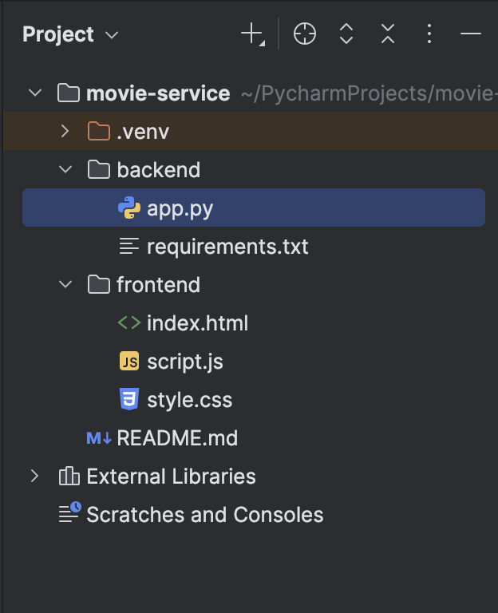
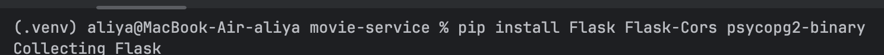
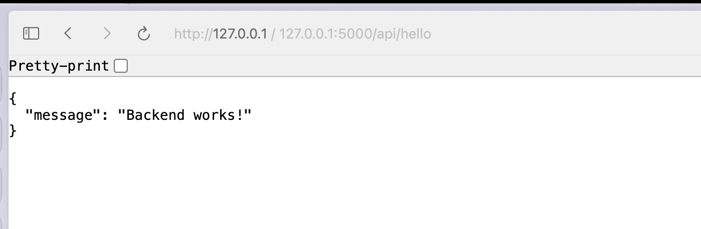
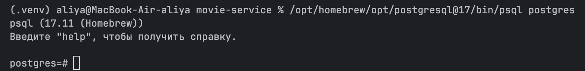
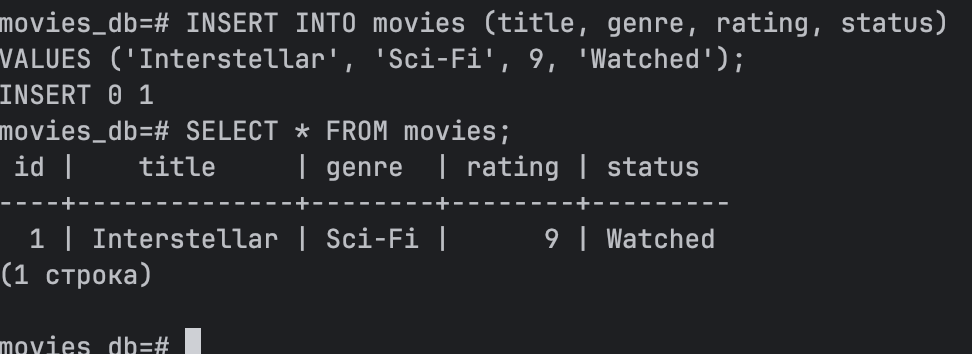
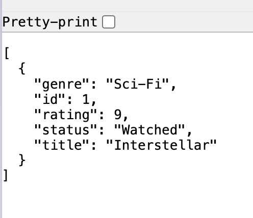
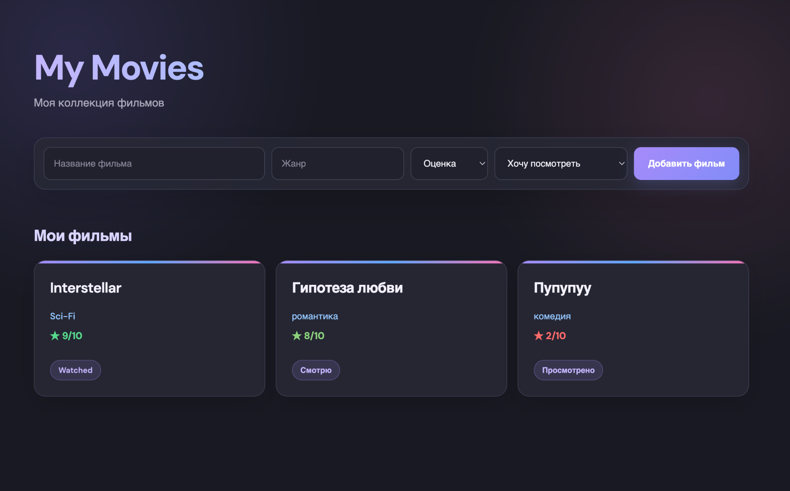
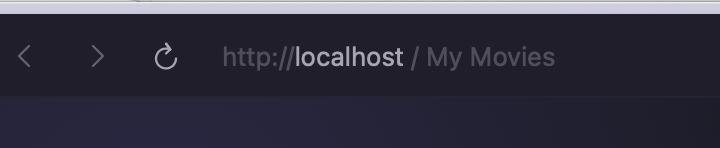
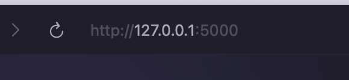

Министерство науки и высшего образования Российской Федерации

ФЕДЕРАЛЬНОЕ ГОСУДАРСТВЕННОЕ АВТОНОМНОЕ ОБРАЗОВАТЕЛЬНОЕ УЧРЕЖДЕНИЕ ВЫСШЕГО ОБРАЗОВАНИЯ

НАЦИОНАЛЬНЫЙ ИССЛЕДОВАТЕЛЬСКИЙ УНИВЕРСИТЕТ ИТМО

ITMO University

# Отчет по лабораторной работе № 0

По дисциплине  Введение в облачные технологии

Обучающийся  Шакирова Алия Ильшатовна

Козьменко Ульяна Сергеевна

Факультет  факультет прикладной информатики

Группа К3262

Направление подготовки 45.03.04 Интеллектуальные системы в гуманитарной сфере

Образовательная программа Языковые модели и искусственный интеллект

Обучающийся  Шакирова А.И., Козьменко У.С.

## 1 Создание своего сервиса

### Цель работы:

Создать простое приложение с фронтендом, бэкендом и базой данных.

### Идея приложения

Для лабораторной работы я решила сделать сервис My Movies. В нём можно будет добавлять фильмы в свой список, указывать жанр, оценку и статус просмотра.

Для приложения мы выбрали:

- Python и Flask  для бэкенда
- HTML, CSS и JavaScript  для фронтенда
- PostgreSQL  для базы данных
Пользователь добавляет фильм на сайте, фронтенд отправляет данные бэкенду, а бэкенд сохраняет их в PostgreSQL

### Структура нашего проекта:

### Для бэкенда использовали flask:

Для проверки работы бэкенда я создала тестовый запрос /api/hello и запустила Flask-сервер. После перехода по адресу http://127.0.0.1:5000/api/hello сервер вернул сообщение Backend works!, значит все работает.

### Для хранения фильмов мы выбрали PostgreSQL

Создали базу movies_db и там таблицу в которой будут храниться название фильма, жанр, оценка и статус просмотра

### Вот проверка:

После создания базы данных подключили её к Flask с помощью библиотеки psycopg2.

В бэкенде создали два запроса:

GET /api/movies - получает фильмы из базы данных;

POST /api/movies - добавляет новый фильм в базу данных.

Для проверки запустили Flask-сервер и открыли в браузере:

`http://127.0.0.1:5000/api/movies`

Потом мы уже приступили к созданию фронтенда и получился уже красивый сайтик🥹🥹🥹

Проверили, что новые фильмы добавляются и все работает супер, при перезагрузке сайта сохраняются добавленные фильмы

** Сначала мы сделали так, что фронтенд открывался через Open in Browser в PyCharm, а Flask запускался отдельно. Пока мы просто разрабатывали приложение, всё работало и вопросов не было.

Потом мы поняли, что преподаватель будет запускать проект на другом компьютере, и такой вариант не очень удобный. Плюс в app.py у нас было напрямую написано:nuser="aliya"

То есть на моём компьютере всё прекрасно работало, а на другом PostgreSQL-пользователь, очевидно, будет называться по-другому :)

Поэтому немного переделали проект. Теперь Flask запускает и бэкенд, и сам сайт, а приложение открывается просто через:

`http://127.0.0.1:5000`

Настройки PostgreSQL вынесли в .env, чтобы каждый мог указать своего пользователя и пароль. Сам .env добавили в .gitignore, потому что чужие логины и пароли в GitHub нам не нужны. А рядом сделали .env.example - пример того, какие настройки нужно указать.

вот до/после

### Git:

Перед загрузкой добавили .gitignore, чтобы случайно не отправить в репозиторий виртуальное окружение .venv и файл .env с локальными настройками PostgreSQL.

С Git сначала немного напутали:) Репозиторий на гитхабе был пустой, а первую версию проекта мы уже сохранили локальным коммитом. При этом по рекомендациям с лекции не хотелось просто пушить всю разработку напрямую в main.

Поэтому для лабораторной сделали отдельную короткоживущую ветку:

`feature/lab0`

Готовую версию проекта сначала отправили туда, а затем через Pull Request объединили с main.

Во время настройки выяснилось, что feature/lab0 случайно стала основной веткой репозитория. После merge поменяли Default branch обратно на main, а временную ветку удалили.

В итоге в main осталась только готовая версия лабораторной, а история Pull Request сохранилась в репозитории.

В результате получилось небольшое веб-приложение My Movies, состоящее из трёх отдельных частей:

`Frontend → Flask backend → PostgreSQL`

Приложение запускается локально, позволяет добавлять фильмы и получать их из базы данных. Данные сохраняются после перезагрузки страницы.

Инструкция по запуску находится в README.md
